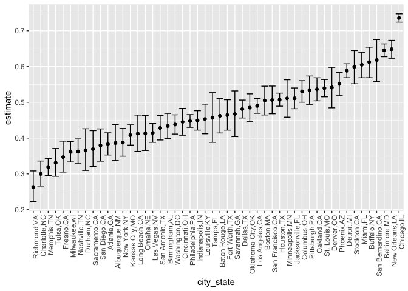
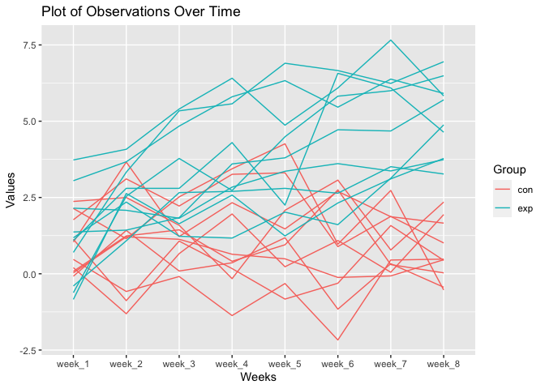
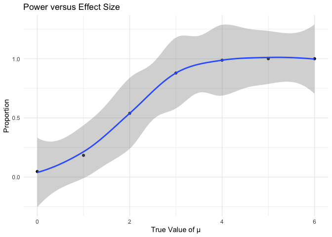
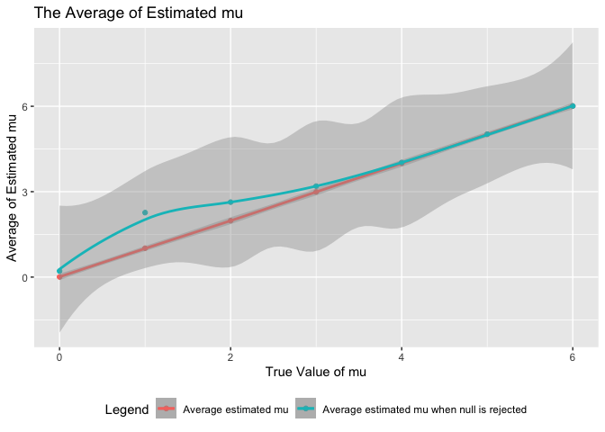

p8105_hw5_jh4617
================
Junjie Hu
2023-11-11

    ## ── Attaching core tidyverse packages ──────────────────────── tidyverse 2.0.0 ──
    ## ✔ dplyr     1.1.3     ✔ readr     2.1.4
    ## ✔ forcats   1.0.0     ✔ stringr   1.5.0
    ## ✔ ggplot2   3.4.3     ✔ tibble    3.2.1
    ## ✔ lubridate 1.9.2     ✔ tidyr     1.3.0
    ## ✔ purrr     1.0.2     
    ## ── Conflicts ────────────────────────────────────────── tidyverse_conflicts() ──
    ## ✖ dplyr::filter() masks stats::filter()
    ## ✖ dplyr::lag()    masks stats::lag()
    ## ℹ Use the conflicted package (<http://conflicted.r-lib.org/>) to force all conflicts to become errors

# Problem 1

## Imported data, created `city_state` variable

``` r
homicide_df =
  read.csv("homicide-data.csv")|>
  janitor::clean_names() |>
  mutate(city_state = paste(city, state, sep = ",")) |>
  filter(city_state != "Tulsa,AL") 
```

The raw data obtains 52178 observations and 13 variables, including uid,
reported_date, victim_last, victim_first, victim_race, victim_age,
victim_sex, city, state, lat, lon, disposition, city_state.

## Summarized with cities

``` r
homicide_df |>
  group_by(city) |>
  summarize(n = n()) |>
  knitr::kable()
```

| city           |    n |
|:---------------|-----:|
| Albuquerque    |  378 |
| Atlanta        |  973 |
| Baltimore      | 2827 |
| Baton Rouge    |  424 |
| Birmingham     |  800 |
| Boston         |  614 |
| Buffalo        |  521 |
| Charlotte      |  687 |
| Chicago        | 5535 |
| Cincinnati     |  694 |
| Columbus       | 1084 |
| Dallas         | 1567 |
| Denver         |  312 |
| Detroit        | 2519 |
| Durham         |  276 |
| Fort Worth     |  549 |
| Fresno         |  487 |
| Houston        | 2942 |
| Indianapolis   | 1322 |
| Jacksonville   | 1168 |
| Kansas City    | 1190 |
| Las Vegas      | 1381 |
| Long Beach     |  378 |
| Los Angeles    | 2257 |
| Louisville     |  576 |
| Memphis        | 1514 |
| Miami          |  744 |
| Milwaukee      | 1115 |
| Minneapolis    |  366 |
| Nashville      |  767 |
| New Orleans    | 1434 |
| New York       |  627 |
| Oakland        |  947 |
| Oklahoma City  |  672 |
| Omaha          |  409 |
| Philadelphia   | 3037 |
| Phoenix        |  914 |
| Pittsburgh     |  631 |
| Richmond       |  429 |
| Sacramento     |  376 |
| San Antonio    |  833 |
| San Bernardino |  275 |
| San Diego      |  461 |
| San Francisco  |  663 |
| Savannah       |  246 |
| St. Louis      | 1677 |
| Stockton       |  444 |
| Tampa          |  208 |
| Tulsa          |  583 |
| Washington     | 1345 |

``` r
homicide_df |>
  filter(disposition %in% c ("Closed without arrest", "Open/No arrest")) |>
  group_by(city) |>
  summarize(n = n()) |>
  knitr::kable()
```

| city           |    n |
|:---------------|-----:|
| Albuquerque    |  146 |
| Atlanta        |  373 |
| Baltimore      | 1825 |
| Baton Rouge    |  196 |
| Birmingham     |  347 |
| Boston         |  310 |
| Buffalo        |  319 |
| Charlotte      |  206 |
| Chicago        | 4073 |
| Cincinnati     |  309 |
| Columbus       |  575 |
| Dallas         |  754 |
| Denver         |  169 |
| Detroit        | 1482 |
| Durham         |  101 |
| Fort Worth     |  255 |
| Fresno         |  169 |
| Houston        | 1493 |
| Indianapolis   |  594 |
| Jacksonville   |  597 |
| Kansas City    |  486 |
| Las Vegas      |  572 |
| Long Beach     |  156 |
| Los Angeles    | 1106 |
| Louisville     |  261 |
| Memphis        |  483 |
| Miami          |  450 |
| Milwaukee      |  403 |
| Minneapolis    |  187 |
| Nashville      |  278 |
| New Orleans    |  930 |
| New York       |  243 |
| Oakland        |  508 |
| Oklahoma City  |  326 |
| Omaha          |  169 |
| Philadelphia   | 1360 |
| Phoenix        |  504 |
| Pittsburgh     |  337 |
| Richmond       |  113 |
| Sacramento     |  139 |
| San Antonio    |  357 |
| San Bernardino |  170 |
| San Diego      |  175 |
| San Francisco  |  336 |
| Savannah       |  115 |
| St. Louis      |  905 |
| Stockton       |  266 |
| Tampa          |   95 |
| Tulsa          |  193 |
| Washington     |  589 |

## Estimated the proportion of homicide that are unsolved

``` r
city_homicide_df = 
  homicide_df |>
  group_by(city, city_state) |>
  summarize(unsolved = sum(disposition %in% c("Closed without arrest", "Open/No arrest")),
            total = n())
```

    ## `summarise()` has grouped output by 'city'. You can override using the
    ## `.groups` argument.

``` r
baltimore_test_df = 
  prop.test( 
    x = filter(city_homicide_df, city_state == "Baltimore,MD") %>% pull(unsolved),
    n = filter(city_homicide_df, city_state == "Baltimore,MD") %>% pull(total)) 

  broom::tidy(baltimore_test_df)
```

    ## # A tibble: 1 × 8
    ##   estimate statistic  p.value parameter conf.low conf.high method    alternative
    ##      <dbl>     <dbl>    <dbl>     <int>    <dbl>     <dbl> <chr>     <chr>      
    ## 1    0.646      239. 6.46e-54         1    0.628     0.663 1-sample… two.sided

## Proportion for each cities

``` r
test_results = 
  city_homicide_df |> 
  ungroup()|>
  mutate(
    prop_tests = map2(unsolved, total, \(x, y) prop.test(x = x, n = y)),
    tidy_tests = map(prop_tests, broom::tidy)) |> 
  select(-prop_tests) |>
  unnest(tidy_tests) |>
  select(city_state, estimate, conf.low, conf.high) |>
  mutate(city_state = fct_reorder(city_state, estimate))
```

## Create plots

``` r
test_results |>
  mutate(city_state = fct_reorder(city_state, estimate)) |>
  ggplot(aes(x = city_state, y = estimate)) + 
  geom_point() + 
  geom_errorbar(aes(ymin = conf.low, ymax = conf.high)) + 
  theme(axis.text.x = element_text(angle = 90, hjust = 1))
```

<!-- -->

# Problem 2

## Imported and combined files

``` r
file_list = 
  list.files(path = "data", full.names = TRUE) 

load_files = function(x){
  
  arm =
    str_extract(x, "con|exp")
  
  id = 
    str_extract(x, "\\d{2}")
  
data = 
    read.csv(x) |>
    janitor::clean_names()|>
    mutate(arm = arm, id = id)
    
}

output = 
  map(file_list, load_files) 

combined_df = 
  bind_rows(output) |>
  pivot_longer(
    week_1:week_8,
    names_to = "weeks",
    values_to = "values"
  )
```

## Made a spaghetti plot

``` r
combined_df |>
  mutate(arm_id = paste(arm, id, sep = "-")) |>
  ggplot(aes(x = weeks, y = values, group = arm_id, color = arm)) +
  geom_line() +
    labs(title = "Plot of Observations Over Time",
       x = "Weeks",
       y = "Values",
       color = "Group")
```

<!-- -->

## Comment

The experimental group has a increase trend, however, the control group
have not change.

# Problem 3

## Set design elements

``` r
set.seed(12345)

sim = function(mu) {

    x = rnorm(n = 30, mean = mu, sd = 5)

    t_result = 
      t.test(x, mu = 0) |>
      broom::tidy()
    
    sim_df =
      tibble(
        t_value = t_result$statistic,
        p_value = t_result$p.value,
        mean_hat = mean(x),
        sd_hat = sd(x)
      ) 
    
}
```

``` r
sim_results = 
  expand_grid(mu_value = 0:6, iter = 1:5000) |> 
  mutate(estimate_df = map(mu_value, sim)) |> 
  unnest(estimate_df) |>
  bind_rows()
```

## Power versus Effect Size

``` r
sim_results |>
  group_by(mu_value)|>
  summarize(
    proportion = mean(p_value < 0.05))|>
  ggplot(aes(x = mu_value, y = proportion)) +
  geom_point() +
  geom_smooth() +
   labs(title = "Power versus Effect Size",
       x = "True Value of μ",
       y = "Proportion") +
  theme_minimal()
```

    ## `geom_smooth()` using method = 'loess' and formula = 'y ~ x'

<!-- -->

The sample average of mu_hat across test for which the null is rejected
is different from the true value of mu. This is because the

``` r
test = 
  sim_results|>
  group_by(mu_value)|>
  summarize(rejected = mean(p_value < 0.05),
            mean = mean(mean_hat),
            mean_rejected = mean(mean_hat[p_value < 0.05]))

ggplot(test, aes(x = mu_value)) +
  geom_point(aes(y = mean, color = "Average estimated mu")) +
  geom_smooth(aes(y = mean, color = "Average estimated mu")) +
  geom_point(aes(y = mean_rejected, color = "Average estimated mu when null is rejected")) +
  geom_smooth(aes(y = mean_rejected, color = "Average estimated mu when null is rejected")) +
  labs(title = "The Average of Estimated mu",
       x = "True Value of mu",
       y = "Average of Estimated mu",
       color = "Legend") +
  theme(legend.position = "bottom") 
```

    ## `geom_smooth()` using method = 'loess' and formula = 'y ~ x'
    ## `geom_smooth()` using method = 'loess' and formula = 'y ~ x'

<!-- -->
